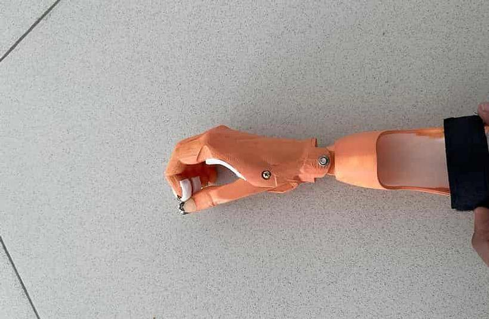
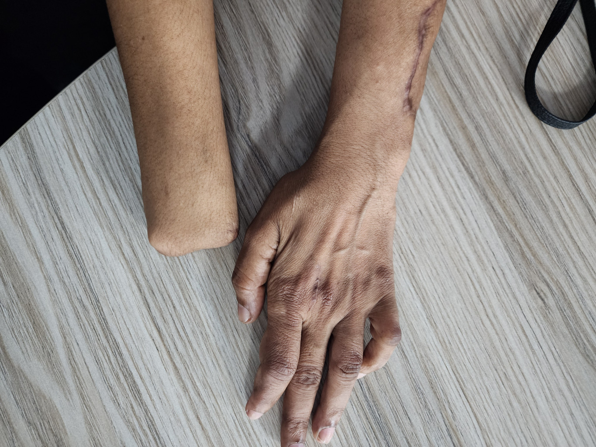

# 🦾 3D-Printed Body-Powered Cosmetic Hand for Wrist Amputees

This open-source project showcases the development of a **body-powered, 3D-printed cosmetic hand** specially designed for a **wrist-level amputee**. Our focus is to provide both **cosmetic realism** and **functional utility** for everyday tasks, using affordable, accessible technologies.

---

## 🎯 Project Goals

- Provide a natural-looking cosmetic hand
- Enable basic functional activities (e.g., holding utensils)
- Ensure the brace does not restrict the user's residual limb movement
- Offer adjustability and comfort for daily wear

---

## 🧠 Key Features

- ✅ **Functional Grip Posture**: Mimics relaxed hand position for functional balance  
- 🔧 **Adjustable Thumb with Groove**: Designed to securely hold objects like spoons or toothbrushes  
- 🧩 **Custom Socket**: Brace was designed to **avoid interfering with wrist-level limb movement**  
- ↕️ **35° Flexion/Extension**: User-adjustable via a built-in screw system for ease of arm positioning  
- 🔒 **Velcro Strap System**: Provides adjustable, secure fitting for daily use  

---

## 🛠️ Design & Fabrication

- 🖨️ **3D Printed in PLA** for lightweight, durable construction  
- 📱 **Hand Scanning** done using the **Polycam App**, enabling a mirrored replica of the healthy hand  
- 🧷 **Assembly** included manual adjustments, mechanical screws, and ergonomic fitting for the residual limb  
- 🎨 **Aesthetic Enhancements** for a realistic appearance and better self-confidence

---

## 📸 Project Images

| Final Prosthetic | Comparison with Other Hand |
|------------------|-----------------------------|
|  |  |

> *(More photos and functional use demos can be added here.)*

---

## 🎥 YouTube Videos

See how we designed, printed, and fit the prosthetic:

- [📽️ Full Design & Scan Process]([https://www.youtube.com/yourvideo1](https://youtu.be/5COPOo_v1os?si=tFaRKq6-4L99RyYk))
- [📽️ Assembly & Fit Tutorial]([https://www.youtube.com/yourvideo2](https://youtu.be/0VDLtoLHIYw?si=wRZ2hUEr7FegPhKu))

---

## 👨‍🔬 Developed By

**Rysera Innovations (Pvt) Ltd – Biomedical Division**  

---

## 🤝 Contribution & Collaboration

We welcome collaboration from **designers**, **clinicians**, **engineers**, and **open-source contributors** to improve the design and reach more patients in need.

---

## 📄 License

This project is licensed under the **MIT License**. Feel free to adapt, improve, and share with proper credit.

